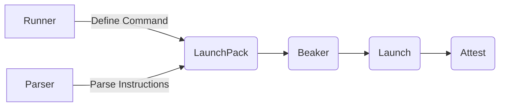

# 🥼 beaker: Run tests and attest the results

This is an experimental tool to run a project's tests and capture the results
in an attestation with a predicate of type [test results](https://github.com/in-toto/attestation/blob/main/spec/predicates/test-result.md).

⚠️ __Warning Experimental!__ ⚠️

Note that beaker is experimental software, feel free to use it and we will 
welcome any patches but there are no guarantees at the moment.

## Runners

Under the covers, beaker uses a pair of a runner and a parser to define a 
launch pack that Beaker executes, capturing the output:

For now, the only launcher executes Go tests. If the experiment proves successful
we wel add new runners and improve their configuration via a config file.

## Use in GitHub Actions

If you want to generate an attestation for your tests in GitHub actions, you can
set up beaker in your runner using the [Carabiner actions](https://github.com/carabiner-dev/actions).

## Contribute

Beaker is copyright bt Carabiner Systems, Inc and released under the Apache 2.0 license.
We welcome any patches, tomatos or kudos but certainly patches are preferred, open a PR 
or issue. We would love to hear from you.

